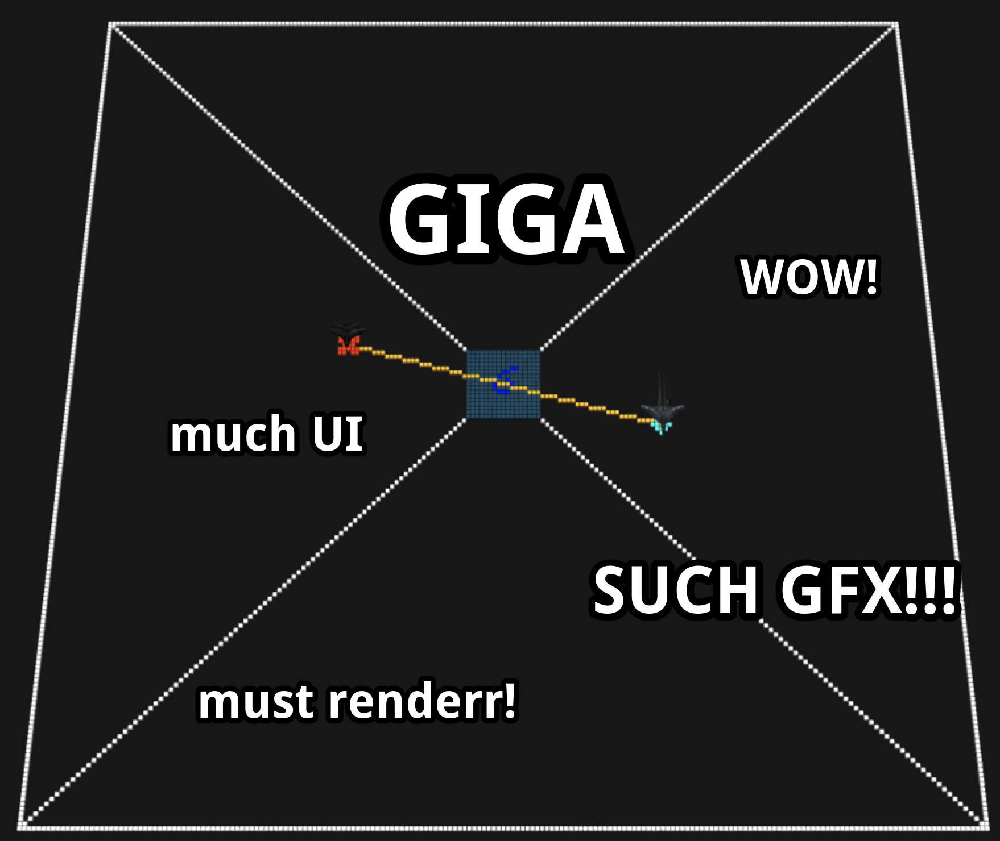

# GIGA - Galactic Invasion Graphical Analyzer



## Local server

Run  locally with teh following commands:
```shell
$ yarn install
$ yarn start
$ open http://localhost:3000/
```

The game state currently is defined in the `pages/index.js` file.
While running local server in dev `yarn start` mode, you can change it and the UI will update.

Work is in progress to allow for drag-n-drop log file parsing.

## About

Welcome to GIGA!

GIGA is a rich graphical UI that helps you replay past space battles that wreaked havok on other galaxies.
Our hope is that this UI would help the brightest and most talented of minds come up with ingenious battle tactics to defend our planet.
All of that is of course while experiencing the amazing visual effects, power by our never-patented CinemaFXD technology.

## Dog friendly

As the battles between intergalactic species may contain images, that can be percieved as graphical by various species, we had to conduct a series of
focus group tests on certain types of animals. My dog approves it, and so should you.

## Company

We are proud to be the company, that successfully implements the first commercial space flight... visualization. We hope you enjoy the view.

# License

A heavely languaged and very legal liguo license can be found somewhere in this repo.
